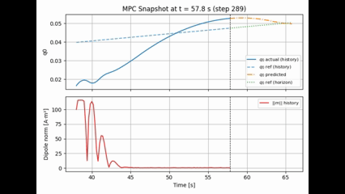

# AE642 SADC Term Paper Repository

Magnetorquer + reaction wheel CLF–QP controller for LEO nadir-pointing attitude control, implemented and evaluated for the AE642 term paper.

---

## Main Scripts

- `sadc.py`  
  Core simulation script. Builds the nonlinear CLF–QP MPC in CasADi, simulates the LEO nadir-pointing scenario, and saves logs and snapshot data in `results/`.

- `plotting.py`  
  Post-processing and plotting utilities. Generates attitude-tracking plots, CLF and slack histories, actuator usage plots, and the MPC snapshot animations from the logs in `results/`.

---

## Key Results

- [MPC snapshot video (`results/mpc_snapshot_animation.mp4`)](results/mpc_snapshot_animation.mp4)  
  Time-lapse of the MPC prediction horizon and applied control as the satellite tracks the nadir-pointing reference along the orbit.

- [Attitude tracking video (`results/attitude_tracking.mp4`)](results/attitude_tracking.mp4)  
  3D visualization of the satellite body-frame axes in inertial space, showing how the attitude evolves and converges to the reference over time.

- [MPC snapshot GIF (`results/mpc_snapshot_animation.gif`)](results/mpc_snapshot_animation.gif)  
  Lightweight GIF version of the MPC snapshot animation used for quick preview and for embedding in documents.
